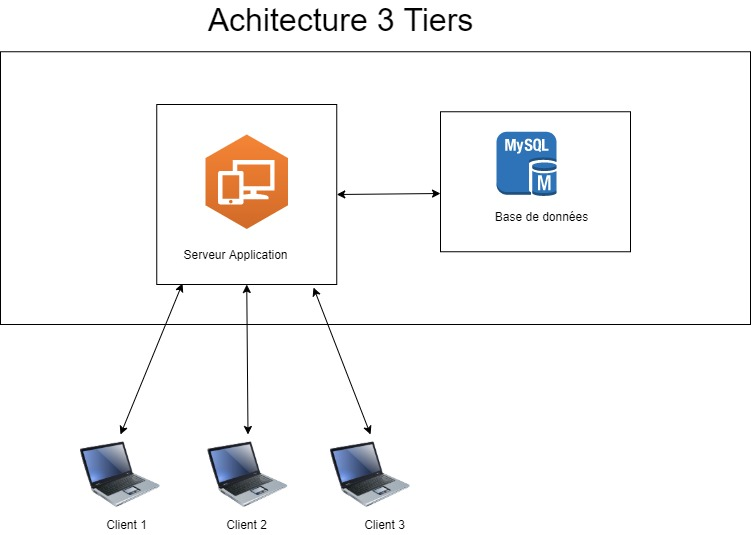
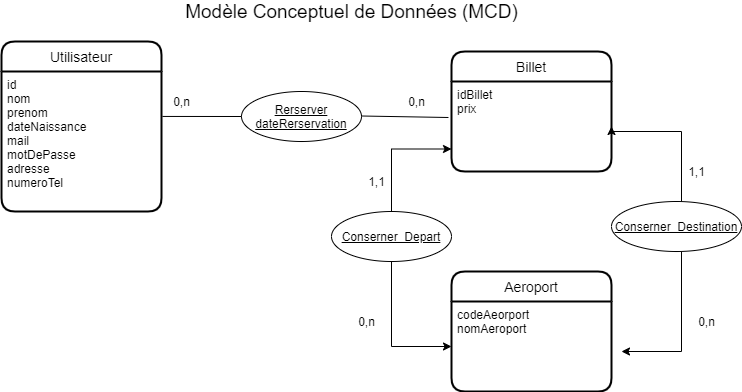
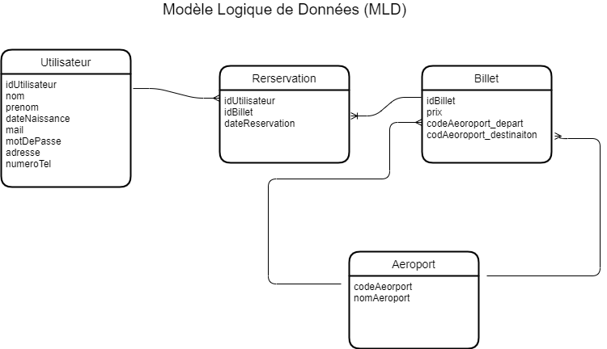
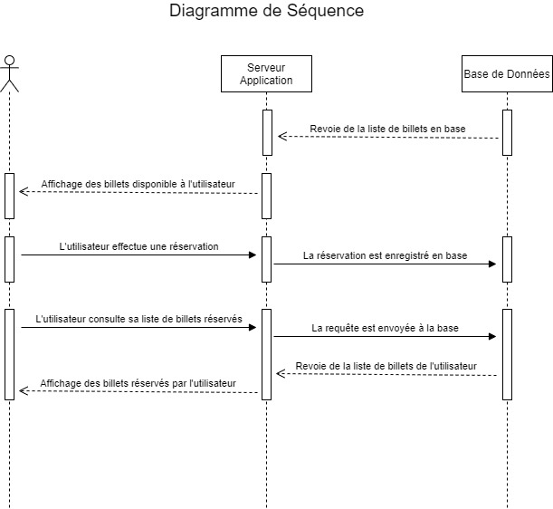
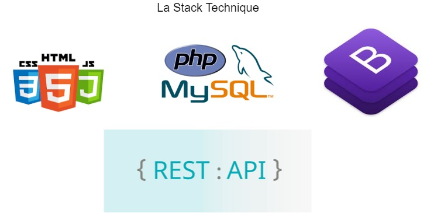

PROJET SITE DE RESERVATION BILLETS D'AVIONS
==

Ce projet a pour but de réaliser un une ebauche de site web de réservation de billets d'avions en ligne.

L'architecture de notre projet sera la suivante :

Notre systeme requiert une base de données. Nous proposons donc le modèle conceptuel suivant que nous pensons pertinent dans la réponse à notre problématique.

Pour plus de clarté, voici le modèle logique relatif à la gestion de nos données:

Nous proposons également un diagramme de séquence afin de mieux comprendre le fonctionnement de notre application:

La stack technique de notre projet sera la suivante : 

Nous utiliserons html/css/js pour le front, php pour le back ainsi que MySQL pour la gestion de nos données.
