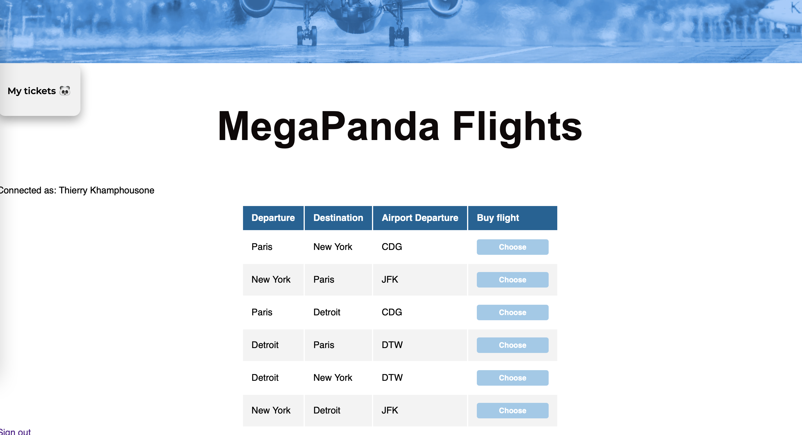
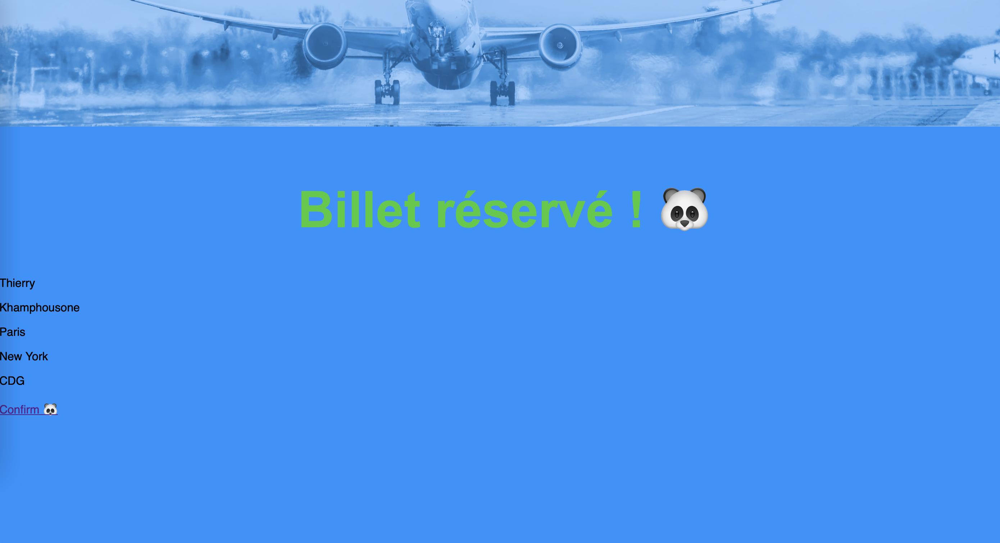

# TP Architecture - IA1-GigaPanda (Js/NodeJs)

## Auteurs
[Thierry Khamphousone](https://www.linkedin.com/in/tkhamphousone/)
[Clara Nacache](https://www.linkedin.com/in/claranacache/)

## Introduction

Réalisation d'une architecture distribuée où une solution simplifiée qui permet à des utilisateurs de réserver un billet d'avion a été mis en place. 


---

## Setup 

1) Cloner le projet et se positionner dans le répertoire 'code'

```bash
> git clone https://github.com/Yulypso/tp-architecture.git
> cd tp-architecture
> git pull
> git checkout IA1-GigaPanda
> cd IA1-GigaPanda/projet/code
```

2) Installer les packages nécessaires depuis le package.json

```bash
> npm install
```

3) Démarrer le server 

```bash
> npm start
````

4) Ouvrir un navigateur web (client) 

```bash
> http://localhost:8080
```

---

## Comment est-ce que notre application fonctionne ?  

### Page Welcome

> En se connectant sur http://localhost:8080, on arrive sur la page d'accueil


### Page Login

> Après avoir cliqué sur le bouton 'Sign in', on arrive sur la page de Login


### Page Flights

> On se connecte, et on arrive sur la page qui nous permet de :
> - choisir le vol souhaité
> - vérifier la liste des vols enregistrés
> - Se déconnecter



### Page billet enregistré

> On choisit par exemple le vol de Paris à New York (CDG) et on confirme. 




### Page mes billets 

> On clique sur 'My tickets' qui nous permet d'afficher la liste de nos billets d'avion


### Gestion d'erreur 

> Si une route n'existe pas, nous affichons le code Erreur et sa trace

