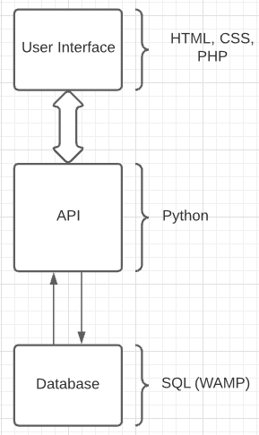
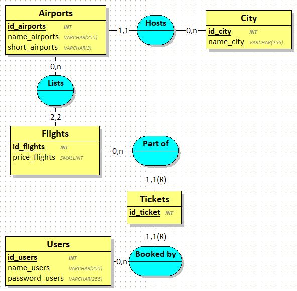

# Design

## Architecture
L’architecture de notre système est formée comme suit :
Un interface utilisateur fait en HTML, CSS, PHP permettant à l’utilisateur de voir la liste des vols disponible, réserver des billets et de voir ses réservations.
Un API en Python permetant d'interagir avec la base de données et récuperer les informations de celle-ci lors de modifications.
Une base de données ayant les informations des billets, des vols et des réservations.

## Modèle de données stockées 

## Stack Technique
### Application et data
  - Python
  - HTML
  - PHP
  - CSS
  - MariaDB

### Utilitaire
  - Stack Overflow
  - Tutorials Point
  - Stack Share

### DevOps
  - Visual Studio Code
  - Github
  - Git
  - Wamp

### BusinessTool
  - Microsoft Teams
  - Discord

### Members
  - ALLAIRE Paul
  - BELLANGER Thibaut
  - CISTERNAS Nicolas
  - JEAN Kévin 
  - VOYER Lucas

  
