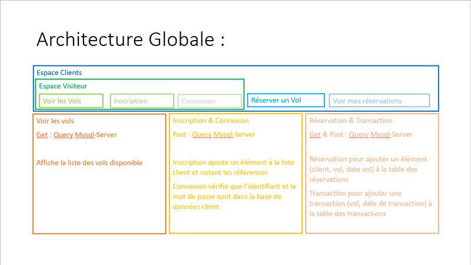
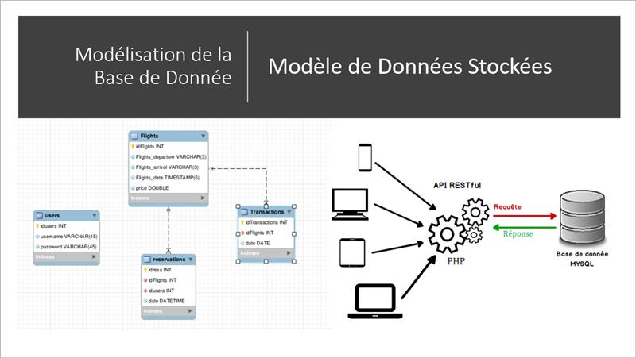

#Contraintes

* Le client doit avoir accès aux Vols disponibles
	* Comment voir les vols disponibles ? 
* Le client doit pouvoir réserver un ou plusieurs vols 
	* Comment gérer l'acquisition de tickets ? 
* Le client doit pouvoir consulter ses réservation
	* Qui réserve combien de vols et lesquels ? 
	* Comment va-t-il faire pour consulter ses réservations ? 

#Implications 

- La plupart de ces questions impliquent l'existence d'une identification client 
-> Espace de connexion/déconnexion
-> Espace client (informations personnelles liées au compte)

- Clientèle internationale
-> Le service de réservation doit être diponible 24h/24

# Architecture Globale 

# Modélisation de la Base de Donnée et Modèle de Données Stockées

 

# Les Stack Techniques 
* PHP
* CSS
* HTTP
* Mysql / SQL
* API 

## Avantages 

* Une installation facile et rapide sur un VM Ubuntu 20.04
* Le PHP est un langage facile à apprendre.Il reprend assez fidèlement la syntaxe du C que nous pratiquons depuis la 1A.
* Le PHP est rapide. Pour la compilation en tant que module Apache, les temps d’exécution sont très performants. (A condition toutefois de l’utiliser sur une plateforme Linux.) 
* Le PHP gère très bien, depuis les origines, les requêtes SQL. On peut donc facilement écrire des programmes qui affichent des données extraites de bases SQL, ou qui stockent des données postées par un formulaire dans une table SQL. Notamment pour notre base de données Mysql.
* Les plateformes Linux/Apache/PHP sont d’une très grande stabilité (sauf mauvaise config à l’origine). Un site peut tourner pendant des mois et des mois sans avoir besoin d’un reboot... Appréciable pour les sites d’e-commerce.
* Il y a un grand nombre de fonctions, couvrant tous les besoins imaginables, entre-autre pour des applications e-commerce. De même qu’il existe des API très stables et bien faites, pour programmer ses propres modules d’extension.
* Grande communauté d’utilisateurs, qui s’entraident au sein de nombreux forums.Ils mettent à disposition des scripts ou des applications complètes en Open Source. 
* PHP est gratuit.  (licence GNU GPL) 
