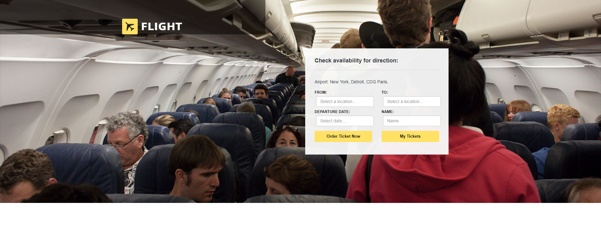
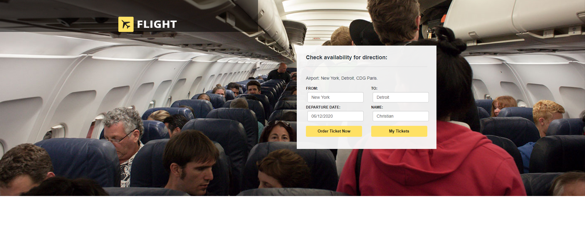
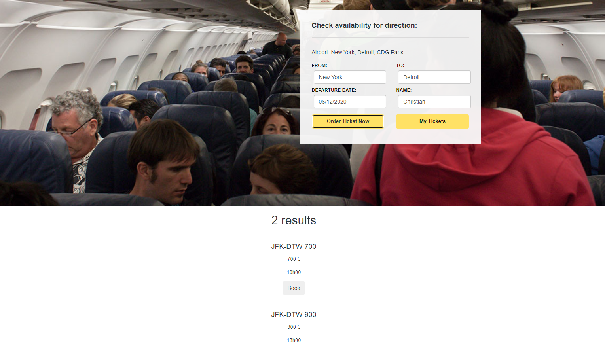
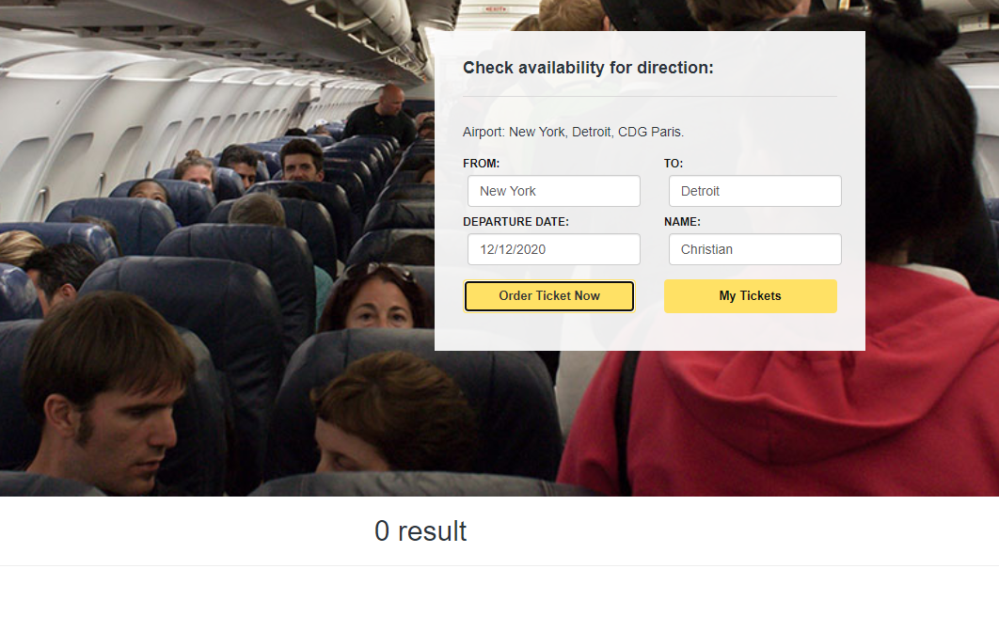
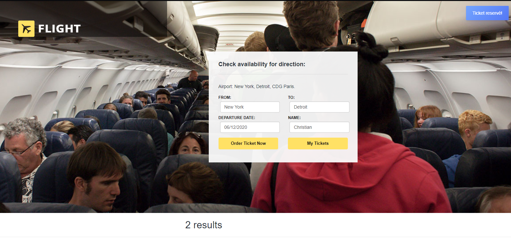
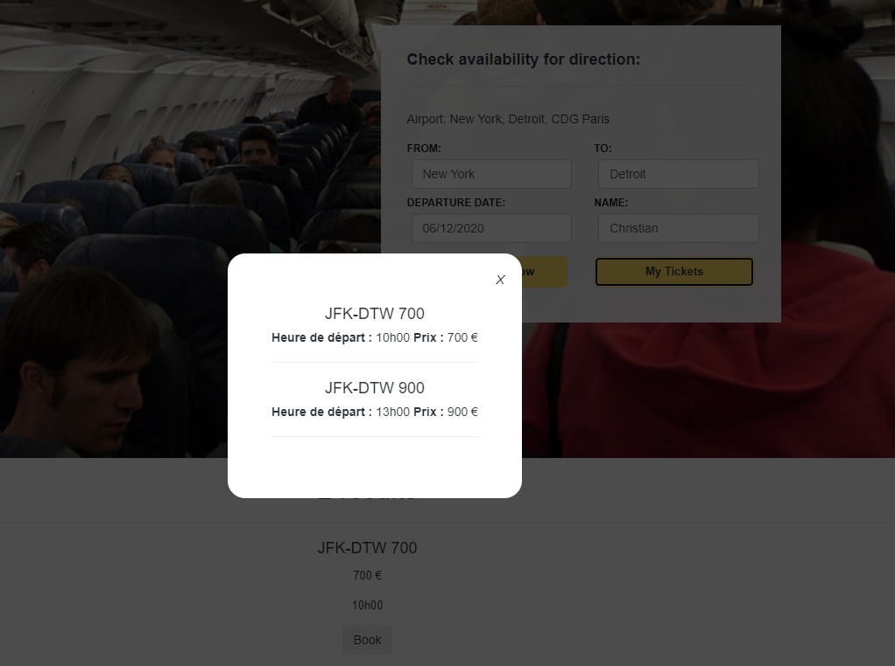

<ol>
  <li>Ouvrir "index.html" sur son navigateur.</li>
  <li>On arrive sur cette page : </li>
  
  <li>On rentre les informations : </li>
  
  <li>
     Si des vols existent : 
     
      
     Sinon : 
      
     
  </li>
  <li>Un pop-up apparaît pour nous avertir de la réservation : </li>
  
  <li>Sinon, différents pop-up d'erreur apparaissent.</li>
  <li>Et enfin, on peut voir nos réservations grâce au bouton "My Tickets" : </li>
  
</ol>
