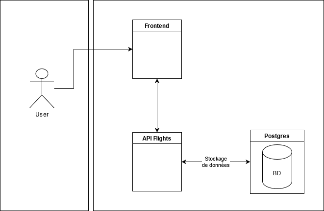
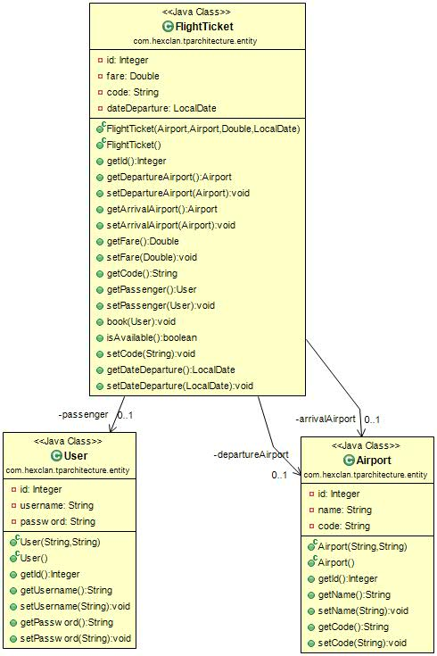

# projet architecture 

# Conception

## Architecture globale

## Modèle de données

# Stack
## Backend
- Java (Spring boot)

## Frontend
- JavaScript (VueJS)

## Base de données
- PostgreSQL 10 (dans un conteneur Docker)