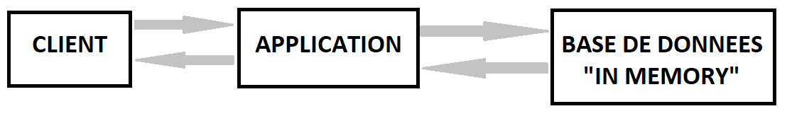
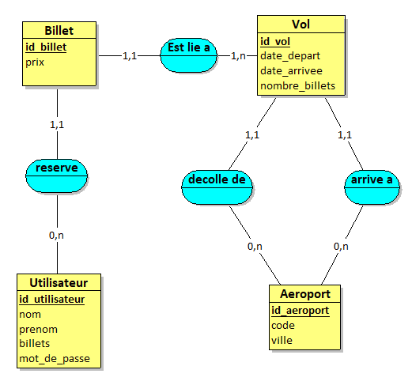

# Design du projet

## Architecture globale

L'architecture choisie pour ce projet et une architecture 3-tiers.
Nous avons choisi cette architecture, car c'est selon nous la plus simple à mettre en place. Notre solution ne nécessitant pas d'architecture plus complexe (pas de micro-services), nous décidons d'utiliser celle-ci.
Nous pouvons représenter cette architecture de cette façon :

La partie « Client » représente le côté front. 

La partie « Application » représente le côté back. C’est elle qui va gérer les requêtes en fonction des besoins de l’utilisateur. 

La partie « Base de données in memory » représente les données utilisées au sein de l’application. Ces dernières sont stockées directement dans des variables implémentées dans le programme. 

## Le modèle de donnée stockée

## La stack technique

Nous avons utilisé les outils suivant:
* **GitHub**, pour la gestion du projet via *git*
  
* **Python**, le langage utilisé pour programmer notre architecture 3-tiers via *Flask*
  
* **HTML5**, pour générer une page Web sur la partie CLIENT
  
* **PyCharm**, l'IDE utilisé sur notre projet
  
* **Flask**, avec *flask-cors*, un micro framework pour le développement WEB
  
* **Vuetify**, une librairie *vue* pour embellir notre page WEB
  
* **CSS**, utilisé en association avec *Vuetify*

Nous avons utilisé Python, car la majorité des membres du groupe était à l'aise avec ce langage programmation.
Nous avions alors le choix entre *Flask* et *Django* pour le framework. Nous avons choisi *Flask* pour sa simplicité d'implémentation, réputée pour les petites applications WEB.
