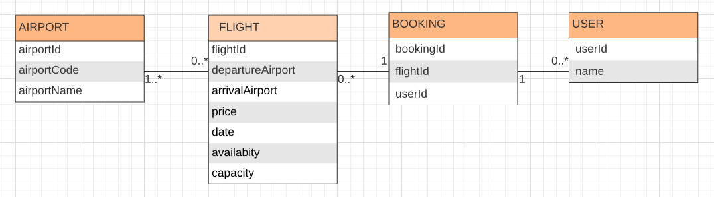

# Design

## Diagramme d'architecture

## Modèle de données

- Storage utilisée : Sérialisation des données dans fichiers en local

## Stack de technique

- Backend : Java (Spring Boot)
- Frontend : JavaScript (Jquery), HTML, CSS (Bootstrap)
