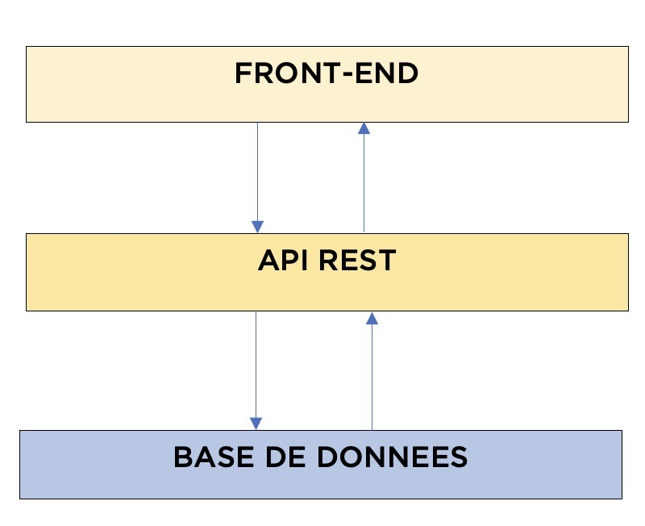
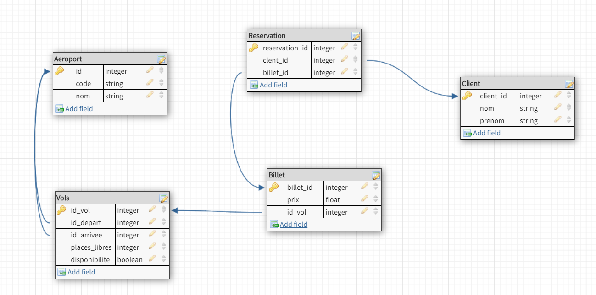
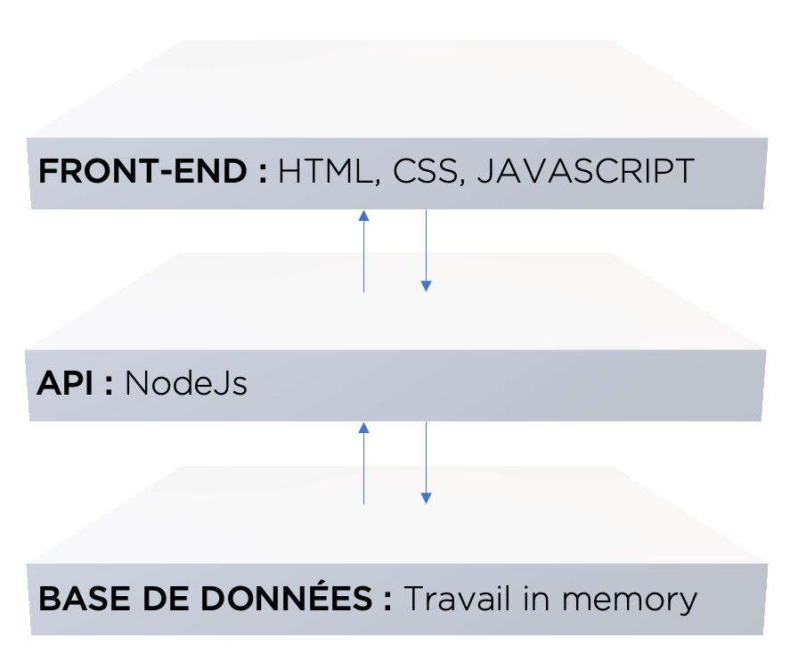

<h2>Schéma d'architecture</h2>

<h2>Modèle de base de données</h2>

<h2>Stack Technique</h2>

<h6>Front-end :</h6>
<ul>
    <li>HTML:
Langage de base du web, pratique.
</li>
    <li>CSS:
Pour le design de notre page
</li>
    <li>JavaScript:
Pour afficher les informations venant de l'API et créer certaines animations
</li>
</ul>

<h6>API :</h6>
<ul>
    <li>NodeJs:
Pour traiter les informations avec notre base de données en mémoire. L'apprentissage de ce framework est facile et rapide contenu de notre TP
</li>
</ul>

<h6>Base de données :</h6>
<ul>
    <li>
On stocke nos données en mémoire
</li>
</ul>

Pour lancer notre site:
    <ul>
        <li>Si vous êtes sur windows il faut le lancer via l'application Visual Studio Code et avoir l'extension "live server"</li>
        <li>Sur Ubuntu, vous pouvez le lancez normalement</li>
    </ul>

