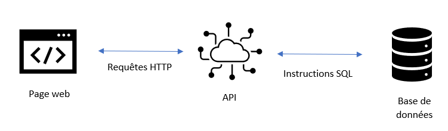
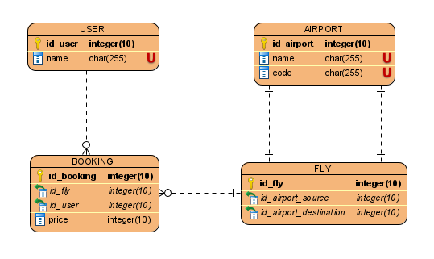

# Design

## L'architecture globale

L'utilisateur accédera à l'application via une page web. Cette page web sera réalisée en HTML, CSS et JavaScript. Nous utiliserons Bootstrap afin de réaliser une interface web graphique permettant au client de se connecter à l'aide d'un identifiant.
Une fois l'utilisateur connecté, celui-ci accédera sur une autre page à 2 points clés:

- Liste des vols disponibles
- Mes réservations

Le premier point présente la liste des vols disponibles avec Aéroport de départ, Aéroport d'arrivée et Prix du billet.
Le deuxième point comprend la liste des billets réservés par le client. S'il n'y en a pas un message s'affichera sur la page.

La page web récupèrera les informations en faisant des appels HTTP à une API REST. Cette API s'interfacera avec le modèle de données pour renvoyer les informations demandées. L'API sera implémentée via le serveur web Express.

Pour stocker les données, nous allons utiliser un SGBD car c'est la solution naturelle. Cela nous permettra de facilement faire évoluer notre modèle s'il on souhaite le modifier.La base de données sera propulsée par MariaDB contenant les informations sur les utilisateurs, vols, réservations et aéroports.

## La stack technique

- GitHub (Travail en équipe, versioning)
- NPM (Gestionnaire de paquets pour NodeJS)
- Express (Framework Back-end)
- HTML/CSS/JS (Front-end)
- Bootstrap (Framework front-end)
- MariaDB (SGBD)

## Explications des choix réalisés

Nous avons choisi le web (HTML/CSS/JS) pour le front-end car ce format nous permet de distribuer l'application sur plusieurs plateformes tels que les smartphones, tablettes ou ordinateurs, sans besoin d'installer un applicatif.

Nous avons choisi le framework Express pour le back-end afin d'aussi utiliser le JS car le JavaScript est un langage simple à utiliser et à mettre en place. De plus, le langage est asynchrone, dispose d'une très bonne documentation et d'une communauté active. Tous ces éléments permettront la maintenabilité du projet.

Le SGBD que nous avons choisi est MariaDB car c'est le SGBD que tous les membres du groupe le maîtrisent.

## Modèle de données

Voici notre MCD :

Un utilisateur possède un nom.  
Un vol contient un aéroport de départ et un aéroport d'arrivé.  
Une réservation a un prix, un vol et un utilisateur.  
