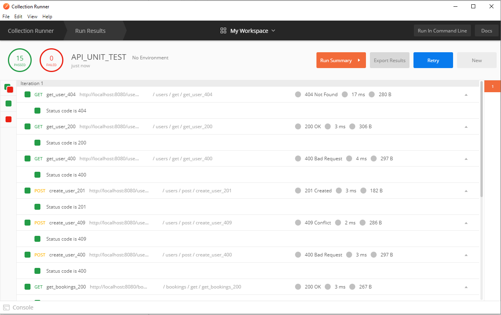

## Procédure d'installation et de démarrage

Installer node.js depuis ce lien : https://nodejs.org/en/

Dans un terminal, aller dans le dossier `back`

Installer les modules npm : `npm install`

Le serveur node.js utilise le port `8080`

Lancer le serveur : `node index.js`

Dans votre navigateur, ouvrir la page web `index.html` depuis le dossier `front`

Si le serveur est redémarré, il faut se reconnecter (sur la page `index.html`)  

## Tests unitaires

Afin de vérifier le fonctionnement de l'API, nous avons créé des tests unitaires avec Postman (voir le dossier `unit_test`).

Voici les résultats :

