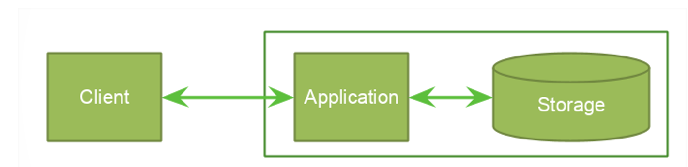
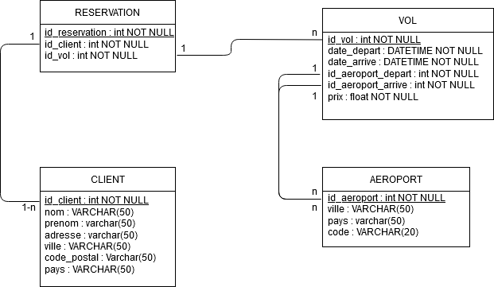

1 -  L'architecture globale : 

Pour ce projet nous avons décidé de prendre une architecture 3-tiers, voici les 3 parties :
- On aura une interface plus ou moins élaboré pour le front-end.
- En ce qui concerne le back-end, on le gérer avec une API.
- pour la partie base de donnée on va créer un fichier avec des objets défini en dur.

2 - Le modele de donnée stocké :

Dans notre modele stocké on y trouve 4 tables.

3 - La stack technique :
 - Data : php
 - Framework : slim
 - DevOps : gitHub, Visual Studio Code et LiveShare