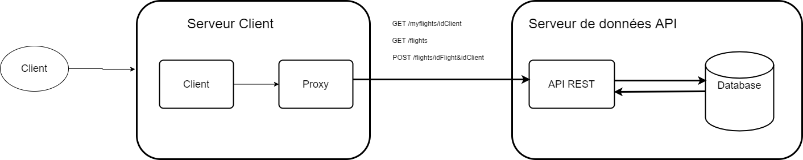
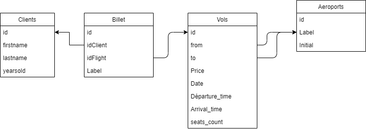

# si3-DDistrib - Design

## Schema architecture

### Explication
Le client envoie les reqûetes sur le server NodeJS. Les requêtes sont des requêtes HTTP. Nous utilisons uniquement les GET et les POST pour obtenir ou envoyer de la données.

Le server NodeJS contient Express, une Interface API REST. Elle va gérer les requêtes HTTP en envoyant les données souhaitées par l'utilisateur.

La base de données dans notre cas est uniquement fais de fichiers locaux en JSON qui seront mis à jours avec Express.

## Modèle de données de stockage

La base de données a été créé dans l'optique d'être intégré à une base de données relationnelle.

## Définition du stack technique
- NodeJS 
- ExpressJS
- MySQL
- ReactJS

## Démonstration
- node server.js	-- lancer l'API 
- cd ./projet/client/si3-ddistrib-client 	-- se déplacer dans le repertoire client
- nmp start		-- lancer l'interface client